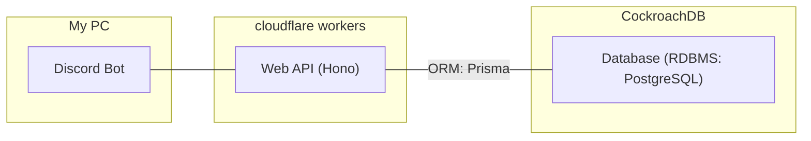
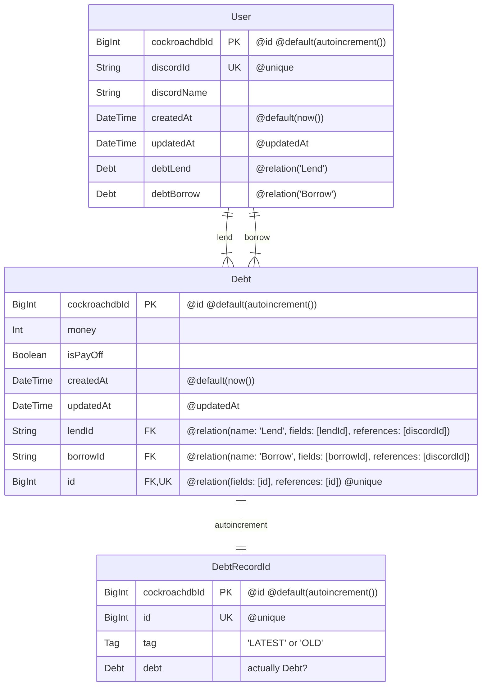

# DebtBot のリリース時に使用するレポジトリ

※ DebtBot のレポジトリは、以下のリンク

[https://github.com/Myxogastria0808/DebtBot](https://github.com/Myxogastria0808/DebtBot)

## bot

-   使用言語: TypeScript
-   discord.js v14 で作成

## backend

-   使用言語: TypeScript
-   WebAPI: Hono
-   ORM: Prisma
-   RDBMS: PostgreSQL

> [!CAUTION]
> プログラムの中に、`console.log()`するべきでない内容を`console.log()`している可能性があります。実際にこのプログラムを使用する際は、`console.log()`を全て消してください。

## 概略図



### 使用を推奨しているパッケージマネージャー

-   yarn

### 環境変数を書くファイルの生成

### Windows ユーザー

```batch
make-env.cmd
```

### Linux ユーザー

> [!CAUTION]
> Linux 環境で実行した際の動作の確認をしていないため正しく動作しない可能性があります。

```shell
bash make-env.sh
```

### bot に置く`.env`ファイルの中身

> [!NOTE]
> 空の文字列(または数字)に適切な情報を入力してください。

> [!CAUTION]
> 　 `.env`ファイルに書く内容は、外部に漏れてはいけない内容なので、必ず`.gitignore`ファイルに`.env`を書いてください。

```.env
TOKEN = ""
APPLICATIONID = ""
GUILDID = ""
REGISTERURL = ""
DELETEURL = ""
WEBAPIURL = ""

```

### backend に置く`.dev.vars`ファイルの中身

> [!NOTE]
> 空の文字列(または数字)に適切な情報を入力してください。

> [!CAUTION]
> 　`.dev.vars`ファイルに書く内容は、外部に漏れてはいけない内容を含むので、必ず`.gitignore`ファイルに`.dev.vars`を書いてください。

```.env
DOMAIN = ""
CLIENTID = ""
CLIENTSECRET = ""
GUILDID = ""
DATABASE_URL = ""
DIRECT_URL = ""
```

## DebtBot のテーブル設計



## Web API のエンドポイント

#### `/user/register`

-   ユーザーの登録を行うエンドポイント

#### `/user/delete`

-   登録されているユーザーの登録を削除するエンドポイント

#### `/debt/create`

-   借金情報を追加するエンドポイント

#### `/debt/pay-off`

-   `isPayOff`を`false`から`true`に変えるエンドポイント

#### `/debt/amount`

-   誰にどれくらい借金をしているかについての情報を返すエンドポイント

# bot のセットアップ

※ bot のコンテナのみ存在する

```shell
docker compose up -d
```

### 参考文献

https://zenn.dev/kameoncloud/articles/99d3ed9d5ce4fd

https://qiita.com/Mijinko/items/df3d2e1f90dbed5a4019

https://uxmilk.jp/23592

https://qiita.com/masayoshi4649/items/46fdb744cb8255f5eb98

https://nova.drifting-clouds.com/blog/mermaid-drawing-with-mdx

https://github.com/sjwall/mdx-mermaid

https://fossengineer.com/selfhosting-cloudflared-tunnel-docker/

https://zenn.dev/hrko/scraps/29df6c7ac02f03

https://fontplus.jp/usage/services/change-on-screen

https://qiita.com/leafeon00000/items/e190cf92af3a487cc749

https://qiita.com/TaikiTkwkbysh/items/1a7d328922e9486a71a6

https://qiita.com/matsuoshi/items/0767198c17d4d0f3c22d
